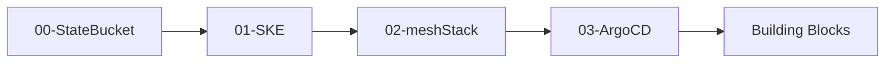
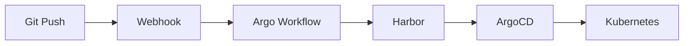

# STACKIT IDP Platform Demo

Complete Internal Developer Platform on STACKIT infrastructure using Terragrunt, ArgoCD, and meshStack.

## Overview

This repository demonstrates a production-ready IDP platform with:
- **Infrastructure as Code**: Terragrunt modules for STACKIT SKE cluster and ArgoCD
- **Self-Service Building Blocks**: meshStack integration for automated provisioning
- **GitOps Delivery**: ArgoCD for continuous deployment
- **Container Registry**: Harbor for image management and distribution
- **App Template**: Python FastAPI starter

## Architecture

### Repository Structure

```
stackit-idp-demo/
├── platform/                           # Platform Infrastructure (Terragrunt)
│   ├── root.hcl                       # Root config + S3 backend
│   ├── 00-state-bucket/               # ⚠️ DEPLOY FIRST - Creates S3 bucket
│   ├── 01-ske/                        # SKE Kubernetes cluster
│   ├── 02-meshstack/                  # meshStack platform integration
│   ├── 03-argocd/                     # ArgoCD GitOps controller
│   ├── deployment-templates/          # Platform-owned deployment Helm charts
│   ├── gitops-state/                  # Example GitOps state repo structure
│   └── building-blocks/
│       ├── stackit-git-repo/          # Git repository provisioning
│       ├── namespace-with-argocd/     # Namespace + ArgoCD app provisioning
│       └── app-env-config/            # Release management (update release.yaml)
├── app-template-python/               # Template for application teams
│   ├── app/                           # Python FastAPI application
│   ├── manifests/                     # Kubernetes manifests (Kustomize)
│   └── .gitea/                        # Template variables
└── docs/                              # Documentation
```

### Platform Infrastructure Flow



### App Team Workflow



## meshStack Building Blocks

This platform provides three building blocks that run in **meshcloud-demo**:

### 1. `stackit-git-repo` - Git Repository Provisioning

Creates a STACKIT Git repository from the `app-template-python` template.

**Inputs:**
- `gitea_username`: Your STACKIT Git username
- `gitea_organization`: Your STACKIT Git organization
- `repository_name`: Name for the new repository
- `template_repo_name`: Repository name for template substitution
- `template_namespace`: Kubernetes namespace for template substitution

**Outputs:**
- Repository URLs (HTML, Clone, SSH)
- Summary with next steps for developers

**What it creates:**
- Git repository from template with variable substitution
- Ready-to-use Python FastAPI application

### 2. `namespace-with-argocd` - Kubernetes Namespace + GitOps

Creates a Kubernetes namespace with ArgoCD application for GitOps deployments.

**Inputs:**
- `namespace_name`: Name of the namespace
- `app_name`: Application name (used for deriving defaults)
- `gitea_username`: STACKIT Git username (for repo URL construction)
- `harbor_robot_username` / `harbor_robot_token`: Harbor credentials
- `expose_app_externally`: Expose app via LoadBalancer (default: false)

**Outputs:**
- Namespace details
- ArgoCD application name
- External URLs

**What it creates:**
- Labeled Kubernetes namespace
- Harbor pull secret
- ArgoCD Application (GitOps)
- Optional: External LoadBalancer service

### 3. `app-env-config` - Release Management (Update release.yaml)

Updates the GitOps state repository with a new container image reference for deployment.

**Inputs:**
- `workspace_id`, `project_id`, `tenant_id`: meshStack context (automatic)
- `image_repository`: Harbor image path (e.g., `harbor.example.tld/team/app/dev`)
- `image_tag` **or** `image_digest`: Image version to deploy (digest preferred for immutability)
- `gitea_username` / `gitea_token`: Git credentials (secret, provided by platform)

**Outputs:**
- Path to committed `release.yaml` file
- Image reference that was deployed
- Deployment flow summary

**What it does:**
- Idempotent Git commit to the GitOps state repository
- Renders `release.yaml` per [ADR-004](docs/adr/ADR-004_decouple-container-builds-from-argocd.md)
- Triggers ArgoCD to redeploy with new image
- Full audit trail in Git

**Workflow:**
1. Developer builds image: `docker push harbor.example.tld/team/app/dev:v1.2.3`
2. Developer runs `app-env-config` Building Block with image reference
3. Building Block commits `release.yaml` to Git
4. ArgoCD detects change and deploys automatically

## Quick Start

### Prerequisites

```bash
# Install tools
brew install terragrunt terraform

# Configure STACKIT credentials
export STACKIT_PROJECT_ID="your-project-id"
export STACKIT_SERVICE_ACCOUNT_KEY_PATH="~/.stackit/sa-key.json"
```

### Deploy Platform

**Step 1: Create State Bucket**
```bash
cd platform/00-state-bucket
terragrunt init
terragrunt apply

# Save credentials
export AWS_ACCESS_KEY_ID=$(terragrunt output -raw access_key_id)
export AWS_SECRET_ACCESS_KEY=$(terragrunt output -raw secret_access_key)
```

**Step 2: Deploy Platform Modules**
```bash
cd ..
terragrunt run-all plan
terragrunt run-all apply
```

**Step 3: Get Cluster Access**

Generate a fresh kubeconfig from IaC outputs (recommended):

```bash
./scripts/kubeconfig-ske-demo.sh
export KUBECONFIG=~/.kube/generated/ske-demo.kubeconfig
kubectl get nodes
```

or

```bash
cd 01-ske
terragrunt output -raw kubeconfig > ~/.kube/stackit-config
export KUBECONFIG=~/.kube/stackit-config
kubectl get nodes
```

### Use Building Blocks (via meshStack)

Once deployed, teams can self-service provision via meshStack portal:

1. **Order Git Repository**
   - Select `stackit-git-repo` building block
   - Provide repository name and namespace
   - Receive ready-to-use Git repository with template code

2. **Order Kubernetes Namespace**
   - Select `namespace-with-argocd` building block
   - Provide namespace name and Git repository URL
   - Receive fully configured namespace with GitOps pipeline

3. **Start Developing**
   - Clone your repository
   - Edit `app/main.py`
   - Push image to Harbor registry
   - Update `release.yaml` in GitOps state repo (or automated by Release Controller)
   - ArgoCD detects Git change → deploys container from Harbor

## State Management

All Terraform state stored in STACKIT S3:
- **Bucket**: `tfstate-meshstack-backend`
- **Endpoint**: `https://object.storage.eu01.onstackit.cloud`
- **Region**: `eu01`
- **Encryption**: Enabled

## Security

- Namespace-scoped RBAC
- Harbor pull secrets for private images
- Secrets via environment variables (never committed)
- Template variable substitution in Git repos

## Documentation

- [Cluster Access Operations](docs/CLUSTER_ACCESS_OPERATIONS.md)
- [Architecture Deep Dive](docs/stackit-idp-architecture.md)
- [ADR: Harbor Registry Strategy](docs/adr/ADR-001_harbor-registry-strategy.md)

## Building Block README Files

For application teams using the building blocks:
- [Git Repository Building Block](platform/building-blocks/stackit-git-repo/APP_TEAM_README.md)
- [Namespace Building Block](platform/building-blocks/namespace-with-argocd/APP_TEAM_README.md)
- [Release Management Building Block](platform/building-blocks/app-env-config/APP_TEAM_README.md)

## Support

This is a demo platform showcasing STACKIT IDP capabilities with meshStack integration.

For production deployments, consider:
- Ingress controller for domain-based routing
- Monitoring (Prometheus/Grafana)
- Backup strategy for GitOps state
- ApplicationSets for auto-discovery
- Advanced RBAC and network policies
